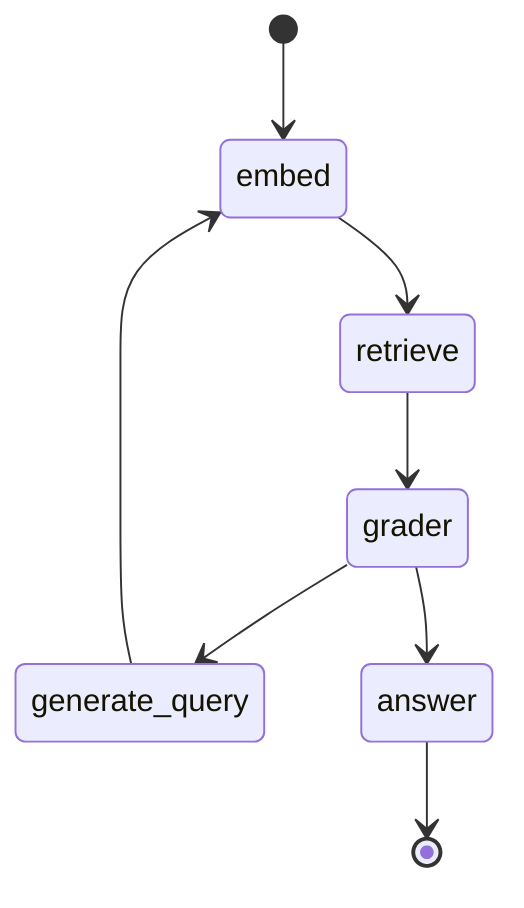

# TinyGraph-ts - Mermaid Example

This is a tiny example of generating mermaid diagrams to help visualize the paths in your application. The example here modifies tinygraph directly, as I recommend for just about any usecase because, well, you *can* and *should* customize.

## Getting Started

```
npm install
npm start
```

After running, you should see the raw text of a Mermaid chart.

## Chart Output



## Note

- Like the RAG example, this is not a feature-full implementation. It just shows how you can customize tinygraph to fit your needs.
- This uses a `PlaceholderNode` just so it does not have to implement state or a bunch of empty nodes. Obviously, your application will differ.
- Other than simple stategraph operations and directionality, this doesn't support any other fancy features like sub-graphs. Feel free to fork, PR, whatever suits you in this regard.